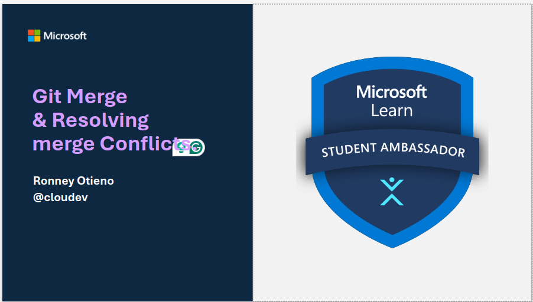

# why this repo?

This repository is dedicated to understanding and resolving merge conflicts in Git. Merge conflicts occur when there are conflicting changes in different branches that need to be merged together. This can happen when multiple developers are working on the same codebase and make conflicting changes.

## Resources

- [see this guided presentation](https://stdntpartners-my.sharepoint.com/:p:/g/personal/ronney_otieno_studentambassadors_com/Ed_L-wu40C5CixAdciHo55gBAsFqN0Gzcry1V3v2w60ruQ?e=0d2Ufd)

- [Learn it yourself on Microsoft Learn](https://learn.microsoft.com/en-us/training/modules/resolve-merge-conflicts-github/)

- [More reference to see more](https://www.atlassian.com/git/tutorials/using-branches/merge-conflicts)

## Understanding & resolving Merge Conflicts With `Best Practices`

- Merge conflicts occur when Git is unable to automatically merge changes from different branches.
- Common causes of merge conflicts include conflicting changes made to the same lines of code, deleted files being modified in one branch and deleted in another, and changes made to the same file in different branches.
- To avoid merge conflicts, it is important to follow best practices such as keeping branches small and focused, pulling frequently to stay up to date, communicating with your team, using descriptive commit messages, effectively using branching and merging features, resolving conflicts promptly, testing changes locally, regularly reviewing and merging changes, and documenting complex merge resolutions.
- By following these best practices, you can minimize the occurrence of merge conflicts and maintain a smooth workflow in your Git projects.

## Contributing

Contributions to this repository are welcome! If you have any suggestions, improvements, or additional resources related to resolving merge conflicts, please feel free to contribute. Fork this repository, make your changes, and submit a pull request. Let's work together to make this repository a valuable resource for developers everywhere!
